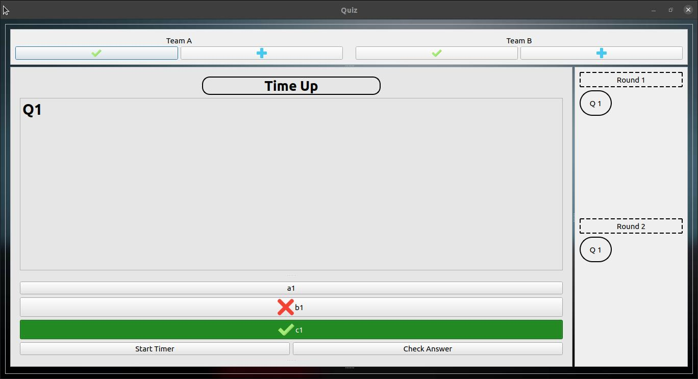
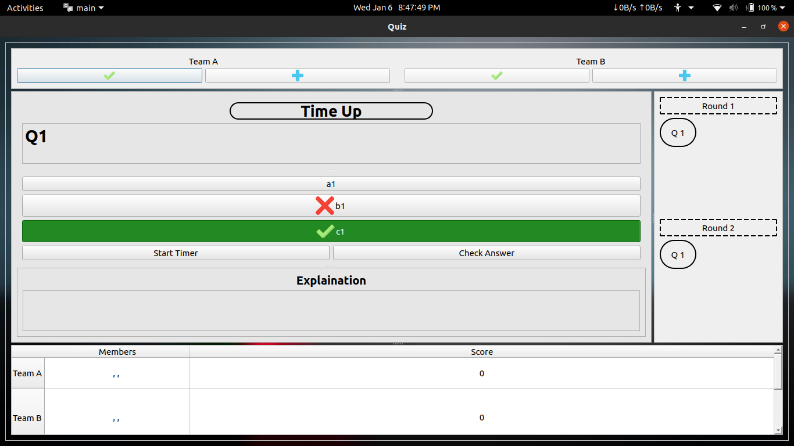
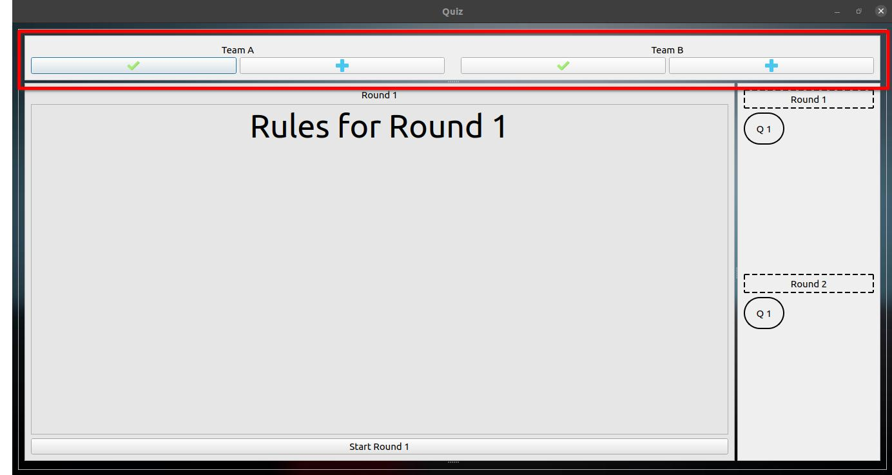
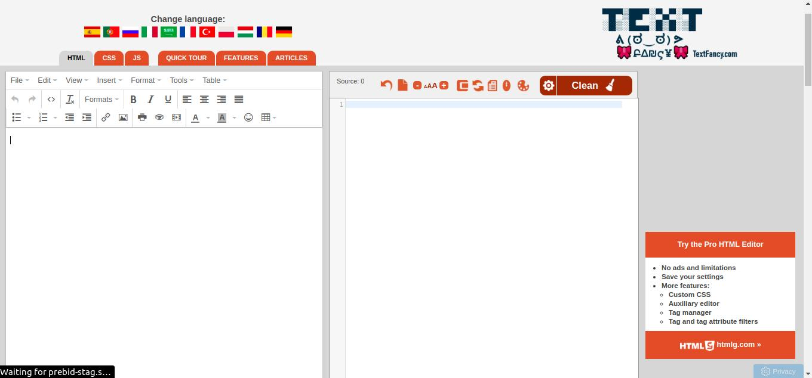

Table of Contents
=================

   * [Table of Contents](#table-of-contents)
   * [Setting up](#setting-up)
      * [Pre Requisites](#pre-requisites)
      * [Linux](#linux)
      * [Windows](#windows)
   * [Usage(Setting up the files)](#usagesetting-up-the-files)
      * [Editing data.json](#editing-datajson)
         * [Welcome](#welcome)
         * [Teams](#teams)
         * [GeneralRules](#generalrules)
         * [Rounds](#rounds)
      * [Editing qns.json](#editing-qnsjson)
      * [Editing media files](#editing-media-files)
   * [Usage](#usage)
      * [Welcome](#welcome-1)
      * [Teams](#teams-1)
      * [General Rules](#general-rules)
      * [App](#app)
   * [TOOLS](#tools)


**Note:** For instructions related HTML refer TOOLS section

***
***
# Setting up
## Pre Requisites
    Any good code editor or IDE
        recomended : VS Code
## Linux
    Move the Quiz file from the dist folder to the root folder and execute it in the terminal

```bash
./Quiz
```

## Windows
    Move the Quiz.exe file from the dist folder to the root folder and execute it


# Usage(Setting up the files)
    There are two main files for the user to edit in order to get desired results
        - Json/data.json
        - Json/qns.json
    Examples are included in Json/examples folder for referance
    

## Editing data.json
    This file is responsible for everything other than the question's content. From deciding the teams to organising rounds everything is done here

The file structure:
        
        1. Welcome
        2. Teams    
        3. GeneralRules
        4. Rounds

### Welcome
    This part has two values one is Topic and other is Hosts

Example:
```JSON
    "Welcome":  
        {
            "Topic": "Engineering Physics",
            "Hosts": ["Naveen", "Karthi", "vicky"]
        }
```
Here **Topic** is a string and **Hosts** is a json array

### Teams
    This part also has two values, one is Team_Names and other is Players_NO

Example:
```JSON
    "Teams":
        {
            "Team_Names"   : ["Team A", "Team B", "Team C", "Team D"],
            "Players_NO"   : 10
        }
```
Here **Team_Names** is a list of team names and **Players_NO** is a integer denoting *Number of players in each team*

### GeneralRules
    This part has only one value 
    it takes either HTML or plain text as input

Example:
```JSON
    "GeneralRules": 
    "General Rules"
```
or
```JSON
    "GeneralRules": 
    "<p style='text-align: center;font-size:100px'><strong>General Rules</strong></p>"
```
Here **GeneralRules** is the one that is displayed in general rules


### Rounds
    This part has n number of values, each having 6 values named nos, rules, tick, plus, minus, time

Example:
```JSON
    "Rounds":
        {
            "Round 1":
                {
                    "nos"   : 1,
                    "rules" : "<p style='text-align: center;font-size:50px'>Rules for Round 1</p>",
                    "tick"  : 50,
                    "plus"  : 25,
                    "minus" : 0,
                    "time"  : 10
                },
            ...
            ...
            ...
        }
```
Here there can be n number of rounds each having 6 values

**nos** is a int refering *Number of Questions in each round*

 **rules** may be a plain text or HTML *Defining the rules and scoring conventions of the round*

 **tick** is a int that denotes *The points that will be awarded for each **correct answer** answered by the team*

 **plus** is also a int that denotes the *The points that will be awarded for each **Bonus answers** by a team*

 **minus** is also a int that denotes the *The points that will be deducted for each **Wrong answers** by a team*
***
 ## Editing qns.json
    This file is responsible everything related Questions. It consists of n number of <RoundName>_Q<No> each having four values named content, options, answer, explain.

Example:
```Json
    "Round_1_Q1" : 
        {
            "content" : "<h1>Q1\n</span>\n</h1>",
            "options" : ["a1", "b1", "c1"],
            "answer"  : "c1",
            "explain" : "Explain 1"
        },
    ...
    ...
    ...
```
Here **content** may be a plaintext or HTML which will be *Displayed as the Question*

**options** is a list of n str elements which will be *Displayed as Options*

**answer** is a str that is in options *which is the answer*

**explain** may be a plaintext or HTML which will be *Displayed as the Explaination* if not possible please set it to a emptystring

## Editing media files
    In this app you can change the sounds played inside it which will be played after answering the question and when time is up

You can change those sounds by replacing the appropriate audio(mp3) files in the with the same in the **Audio/** folder

The Background images can be changed by replacing the appropriate inage (jpg) files in the with the same in the **BG/** folder

# Usage
    In This part let us go through the gui part of the application. There are 4 screens in total.
        -Welcome
        -Teams
        -GeneralRules
        -App
    Note: This is a one way app if the next screen is reched there is no way back

## Welcome


Click on **Start Quiz** to continue
---

## Teams


Here enter the members of each teams and hit **Done** to continue
---

## General Rules


Click on the **GOT IT!!!** to continue
--

## App


This is the screen you will use to conduct the QUIZ

click on **Start Round** to set scorings appropriate to cuurent round
---


Then use the navigator in the right side to move to the desired question
---




after moving to the question, you can start the timer by clicking the **Start Timer** Button and Check if the answer is right using **Check Answer** Button after clicking it
---



dragging from the bottom to top you can open explaination for each question and doing it from the bottom of the app you can see the scores of individual teams
---



using the top bar the scores are given manually by the hosts
---

---
**Focus more on the content not on the boring prelim works!!!**
---

---


# TOOLS

website: [Use this free online HTML Editor](https://html-online.com/editor/)



In addtion to the above tool use the **Tools/Html_edit.py*** to format the html to work

For this paste the HTML in the **Tools/text.txt** file and save it, Then run the above mentioned file.

Then you will be all set to add it to the Json


***HAPPY QUIZING**
---
---